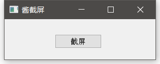
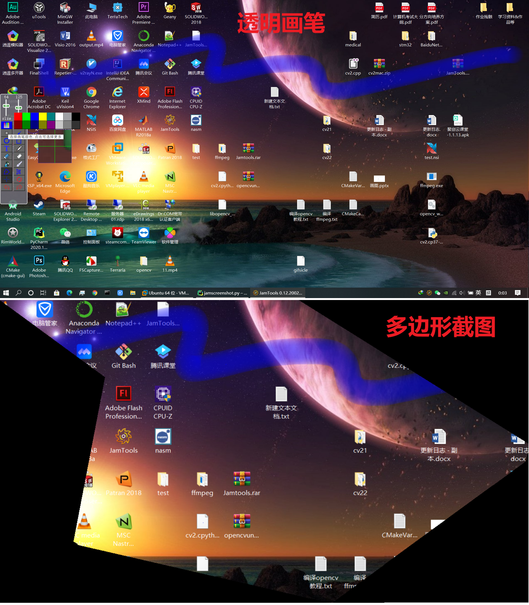
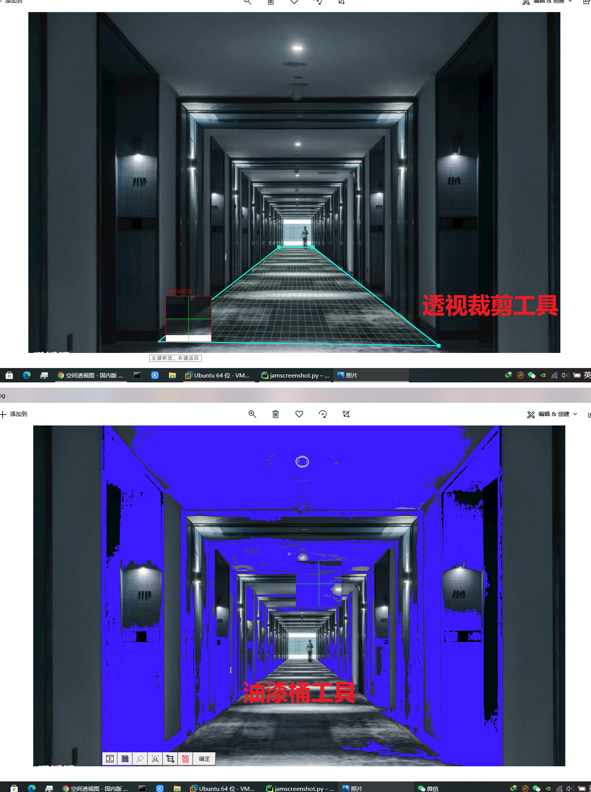
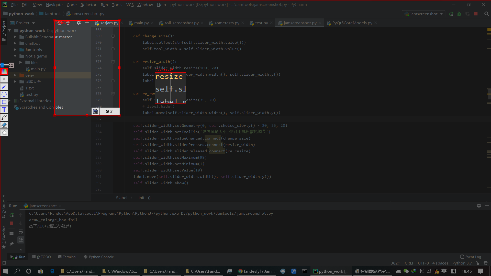
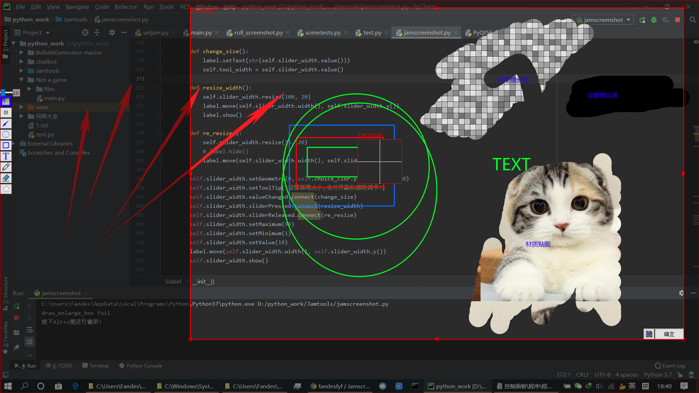

# Jamscreenshot
一个用python实现的类似微信QQ截屏的工具源码，
来自本人自制工具集[Jamtools](https://github.com/fandesfyf/JamTools)里面的截屏部分整合，代码完全原创，分享出来
转载请标明出处！

如果你还需要滚动截屏功能,可以看看[这个](https://github.com/fandesfyf/roll_screenshot)

<!-- 个人资料徽标 -->

<!--   &emsp; -->
  &emsp;
  &emsp;
<!-- 访客数统计徽标 -->
  

  
----20210206更新------

新增了透视裁剪工具(类似于PS里的用法)、多边形截图工具、取色器工具、油漆桶工具、背景还原画笔(配合背景橡皮擦使用)、支持回退10步操作历史记录、新增一键还原按钮、新增智能选框的开关。画笔等增加透明度支持，在画笔/标记时可以通过按住ctrl键+滚轮快速调整画笔透明度，新增常用颜色到取色按钮(鼠标划过即可显示)、固定截屏在屏幕上时可以通过按住ctrl+滚轮快速调节截屏的透明度

# 效果图
加了一个简陋的主界面

截图效果：

可以看到，几乎实现了微信截图的所有功能，还有一些微信截图没有的功能，像材质图片画笔、背景橡皮擦、所有颜色自选、画笔大小/放大镜倍数可通过滑轮调节等；
代码总长2000+行，直接运行即可！

-----------------2020.4.9更新--------------

更新：
支持把多个图片固定在屏幕上

支持窗口控件识别(基于opencv的轮廓识别功能)，需要opencv库！

直接pip install opencv-python即可(滚动截屏需要安装contrib版本的opencv,版本小于opencv-contrib-python==3.4.2.17)

# 模块安装
主要使用的是PyQt5模块
直接 pip install PyQt5 即可
还需要PIL
直接pip install Pillow 即可

附带的jamresourse.py文件是图片资源文件(鼠标样式等)

# 提交环境为python3.7   pyqt5==5.13.2  win10 一切正常!
其他环境自行测试

# 说一说大概的思路吧
截屏流程：

先分析用户动作：用户点击截屏按钮(或按下快捷键)时截屏软件开始响应(通过一个按钮事件或者pyqtsignal，其实都是signal，来调用起截屏函数screen_shot)，迅速截下当前屏幕的全屏内容(通过pyqt的grabWindow函数)，同时显示截屏界面。

   对截屏界面有几点说明：

   1.截屏界面就是一个全屏窗口而已，该窗口是一个label类型的控件(因此可以直接将其当做背景层)有置顶、无边框、鼠标追踪等属性

   2.截屏界面由背景层(Slabel本身)、绘图层(PaintLayer类)和遮罩层(MaskLayer类)依次堆叠而成，每一层都是一个Qlabel,绘图层和遮罩成以Slabel作为parent,并调用self.parent.xxx直接获得Slabel的属性。背景层用于显示之前截屏时的那个全屏内容，因为之前那个截屏是全屏幕截的，当前窗口又是全屏窗口，所以显示背景中的内容的位置就是之前在屏幕中实际的位置，而且这个时间很短，看起来的结果就像是用户直接操作在屏幕上一样；第二层是绘图层，有透明背景属性，用于用户进行涂鸦等操作(画笔中除了背景相关的画笔几乎都作用于这一层)；最上面一层是遮罩层，该层主要用于显示截屏的阴影部分和方框(只是显示而已，背后的逻辑还是在它的parent即Slabel中)

  区域截屏过程：在进入截屏界面后用户可以点击屏幕(该动作由mousePressEvent捕获)，然后拖动(由mouseMoveEvent捕获)，然后松开(由mouseReleaseEvent捕获)，同时弹出确定按钮(botton_box)即可在界面上显示出选区界面。
  
  关于选框参数,所有参数均在Slabel主类中设置,self.x0,x1,y0,y1是选区的对角坐标,在用户点击下鼠标左键时,记录下当前的位置,然后动鼠标时记录下鼠标位置,当松开鼠标时记录下松开的位置.注意每次点击/移动/松开鼠标都会调用update函数使得所有层(包括遮罩层)的界面更新(即自动调用了paintEvent函数)

